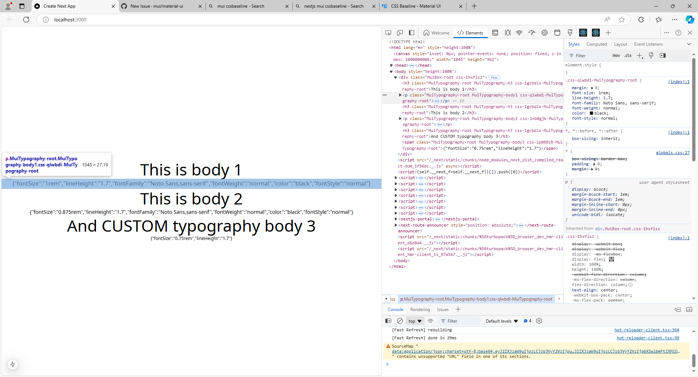

This is a [Next.js](https://nextjs.org) project bootstrapped with [`create-next-app`](https://nextjs.org/docs/app/api-reference/cli/create-next-app).

## Getting Started

First, run the development server:

```bash
npm run dev
# or
yarn dev
# or
pnpm dev
# or
bun dev
```

Open [http://localhost:3000](http://localhost:3000) with your browser to see the result.

body1 and body2 are default typography variants. body3 is a custom variant.

Note the lack of fontFamily in body3 which should have been provided from typography.fontFamily. Also the lack of fontWeight, color and fontStyle in body3 which should have been provided from typography.allVariants (see myTheme.tsx).
In addition, responsiveFontStyles has had no effect on any of the variants - none of them have responsive font styles.


